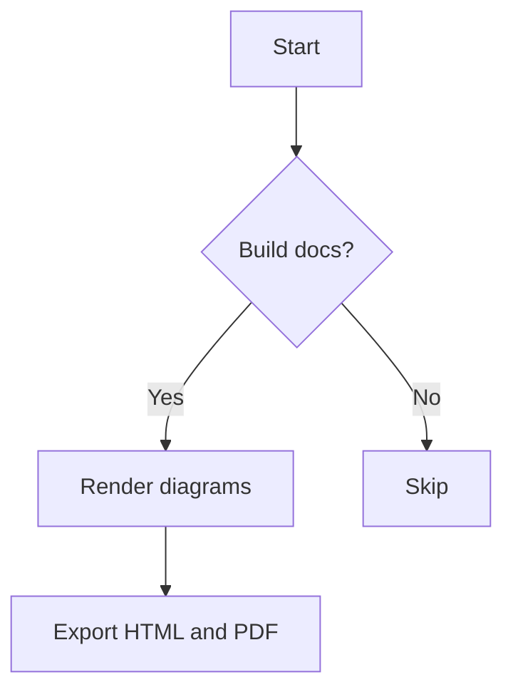
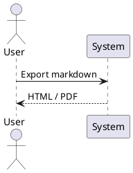

# xMarkdown2PDF

Convert Markdown with Mermaid and PlantUML to HTML or PDF directly inside VS Code.

xMarkdown2PDF is built for teams that want a focused workflow:
- live side-by-side preview while editing Markdown
- local HTML export
- local PDF export
- branded PDF headers and footers for company-ready documents
- Mermaid support in preview and export
- LaTeX formulas in preview and export
- PlantUML support in preview and export
- versioned runtime libraries that you can upgrade intentionally

It is not trying to be a full Markdown authoring platform. The goal is a smaller, clearer extension for documentation workflows that depend on diagrams.

## Why This Extension Exists

The VS Code marketplace already has strong Markdown and diagram extensions. xMarkdown2PDF fits in the gap between them:

| Extension | Main focus | Mermaid | PlantUML | Live preview | HTML export | PDF export | Library version control |
|---|---|---|---|---|---|---|---|
| xMarkdown2PDF | Focused Markdown to HTML/PDF with diagrams | Yes | Yes | Yes | Yes | Yes | Yes |
| Markdown PDF (`yzane.markdown-pdf`) | Broad export toolchain with many output options | Yes | Yes | Limited to export-oriented workflow | Yes | Yes | No explicit managed library workflow |
| Markdown Preview Enhanced (`shd101wyy.markdown-preview-enhanced`) | Full Markdown authoring platform | Yes | Yes | Yes | Yes | Yes | No explicit managed library workflow |
| Markdown Preview Mermaid Support (`bierner.markdown-mermaid`) | Mermaid in built-in preview | Yes | No | Yes | No | No | No |
| PlantUML (`jebbs.plantuml`) | Dedicated PlantUML authoring and export | No | Yes | Yes | Diagram export, not Markdown document export | Diagram export, not Markdown document export | No |

## When xMarkdown2PDF Is a Better Fit

Choose xMarkdown2PDF if you want:
- one extension for Markdown preview plus document export
- Mermaid and PlantUML in the same Markdown document
- a smaller feature surface than Markdown Preview Enhanced
- HTML and PDF output from the same rendering pipeline
- a controlled way to update embedded runtime libraries

Choose other extensions if you want:
- PNG or JPEG export: Markdown PDF is broader here
- advanced Markdown notebooks, code chunks, Pandoc, presentations, or publishing workflows: Markdown Preview Enhanced is broader here
- rich PlantUML authoring features such as snippets, symbol navigation, and standalone diagram project workflows: PlantUML is stronger here
- only Mermaid in the built-in VS Code preview: Markdown Preview Mermaid Support is simpler here

## Features

- Preview Markdown in a side-by-side webview panel
- Auto-refresh preview while you edit
- Scroll sync from editor selection to preview
- Optionally show a generated table of contents in the preview
- Export `.md` to `.html`
- Export `.md` to `.pdf`
- Add professional PDF branding with configurable company header/footer templates
- Generate a linked table of contents for exported HTML and PDF
- Generate viewer-friendly document outlines for exported HTML and PDF
- Render Mermaid diagrams in preview and export
- Render LaTeX math formulas in preview and export
- Render PlantUML diagrams to inline SVG before export
- Support PlantUML render modes:
  - local
  - self-hosted PlantUML server
  - Kroki
- Upgrade bundled runtime libraries with a command
- Theme support for preview and export:
  - `github`
  - `dark`
  - `custom`

## Commands

| Command | Description |
|---|---|
| `xmarkdown2pdf.openPreview` | Open the live preview beside the active Markdown editor |
| `xmarkdown2pdf.exportHtml` | Export the active Markdown file to HTML |
| `xmarkdown2pdf.exportPdf` | Export the active Markdown file to PDF |
| `xmarkdown2pdf.upgradeLibs` | Upgrade managed runtime libraries |

Default keybinding:
- `Ctrl+Shift+V` opens the xMarkdown2PDF preview for Markdown files

## Installation

### From VS Code Marketplace

Search for `xMarkdown2PDF` in Extensions.

### From a VSIX file

```bash
code --install-extension /absolute/path/to/xmarkdown2pdf-0.1.4.vsix
```

## Browser Setup for PDF Export

If you already have Chromium or Chrome installed/downloaded locally, you can use it instead of Puppeteer's managed browser.

```json
{
  "xmarkdown2pdf.pdf.browserExecutablePath": "/absolute/path/to/chrome-or-chromium",
  "xmarkdown2pdf.pdf.launchArgs": [
    "--no-sandbox",
    "--disable-setuid-sandbox",
    "--disable-dev-shm-usage"
  ]
}
```

Notes:
- `xmarkdown2pdf.pdf.browserExecutablePath` must be the exact executable file path, not a folder.
- If the path is empty, xMarkdown2PDF auto-detects Windows Chrome/Edge from common install paths first, then falls back to Puppeteer's default browser resolution.
- If the path is configured but invalid, export fails with an explicit error and a shortcut to open the setting.

## Library Setup and Degraded Mode

After installing the extension, run this once so diagram libraries are present and up to date:

1. Open Command Palette.
2. Run `Markdown: Upgrade Libraries`.
3. Wait for the success notification.
4. If needed, open output channel `xMarkdown2PDF — Upgrade` to see details.

### Proxy/Network Issues and Degraded Mode

If a library fails to download (for example, due to a proxy or network restriction), the extension will alert you and enter "degraded mode." In degraded mode, features that depend on missing libraries are disabled, but the rest of the extension continues to work.

**Manual Recovery:**

1. Download the missing library file(s) manually from a trusted source (see the output/error message for the required file name).
2. Place the file(s) on your machine.
3. Open VS Code settings and set the appropriate path(s):
  - `xmarkdown2pdf.preview.mermaidJsPath`
  - `xmarkdown2pdf.preview.highlightJsPath`
  - `xmarkdown2pdf.preview.mathJaxJsPath`
  - `xmarkdown2pdf.plantuml.jarPath`
4. The extension will use your provided path(s) instead of the missing managed library.

You can always re-run `Markdown: Upgrade Libraries` after fixing your network/proxy to restore managed libraries.

This command downloads and stores managed runtime files under `media/libs/`:
- `mermaid.min.js`
- `highlight.min.js`
- `tex-chtml-full.js` (MathJax)
- `plantuml.jar`

### Configure PlantUML Linking in Settings

Open your VS Code `settings.json` and choose one mode.

#### Local mode (recommended)

Use the bundled `plantuml.jar` managed by the extension:

```json
{
  "xmarkdown2pdf.plantuml.renderMode": "local",
  "xmarkdown2pdf.plantuml.jarPath": ""
}
```

Use your own custom jar path:

```json
{
  "xmarkdown2pdf.plantuml.renderMode": "local",
  "xmarkdown2pdf.plantuml.jarPath": "/absolute/path/to/plantuml.jar"
}
```

#### Server mode

```json
{
  "xmarkdown2pdf.plantuml.renderMode": "server",
  "xmarkdown2pdf.plantuml.serverUrl": "https://your-plantuml-server/plantuml"
}
```

#### Kroki mode

```json
{
  "xmarkdown2pdf.plantuml.renderMode": "kroki"
}
```

### Notes

- For local mode, make sure Java is installed on your machine.
- `xmarkdown2pdf.plantuml.jarPath` is only used when the path exists; otherwise the extension falls back to the managed jar.
- PlantUML server URL must be `http` or `https`.

## Quick Start

1. Open a Markdown file.
2. Run `Markdown: Open Preview (WYSIWYG)`.
3. Add Mermaid or PlantUML fenced code blocks.
4. Run `Markdown: Export to HTML` or `Markdown: Export to PDF`.

Exported files are written next to the source Markdown file using the same base name.
By default, exports include a linked table of contents generated from document headings.
PDF exports also enable browser-supported outline bookmarks by default, and HTML exports expose a semantic document outline from those same headings.

## Example

### Mermaid

````markdown

````

### PlantUML

````markdown

````

### LaTeX Formulas

````markdown
Euler identity inline: $e^{i\pi} + 1 = 0$

Display mode:

$$
\int_{0}^{\infty} e^{-x^2} \, dx = \frac{\sqrt{\pi}}{2}
$$
````

A larger sample document is included in the extension package as `sample.md`.

## Settings

| Setting | Description | Default |
|---|---|---|
| `xmarkdown2pdf.pdf.format` | PDF page format | `A4` |
| `xmarkdown2pdf.pdf.margin` | PDF margins | `20mm` on all sides |
| `xmarkdown2pdf.pdf.printBackground` | Print backgrounds in PDF | `true` |
| `xmarkdown2pdf.pdf.browserExecutablePath` | Local Chromium/Chrome executable path for PDF export (when empty on Windows, xMarkdown2PDF auto-discovers common Chrome/Edge install paths) | empty |
| `xmarkdown2pdf.pdf.launchArgs` | Browser launch arguments for PDF export | `--no-sandbox`, `--disable-setuid-sandbox`, `--disable-dev-shm-usage` |
| `xmarkdown2pdf.plantuml.renderMode` | PlantUML render backend | `local` |
| `xmarkdown2pdf.plantuml.serverUrl` | PlantUML server URL when using server mode | empty |
| `xmarkdown2pdf.plantuml.jarPath` | Path to `plantuml.jar` for local mode | empty |
| `xmarkdown2pdf.preview.includeToc` | Include the generated table of contents in the live preview panel | `false` |
| `xmarkdown2pdf.preview.scrollSync` | Sync editor selection to preview | `true` |
| `xmarkdown2pdf.preview.theme` | Preview/export theme | `github` |
| `xmarkdown2pdf.preview.customCssPath` | Custom CSS path for `custom` theme | empty |
| `xmarkdown2pdf.preview.mermaidJsPath` | Custom Mermaid JS path | empty |
| `xmarkdown2pdf.preview.highlightJsPath` | Custom Highlight JS path | empty |
| `xmarkdown2pdf.preview.mathJaxJsPath` | Custom MathJax `tex-chtml-full.js` path | empty |
| `xmarkdown2pdf.mathJaxTimeoutMs` | Timeout (ms) to wait for MathJax typesetting during PDF export. Increase for large/complex LaTeX. | 5000 |
| `xmarkdown2pdf.export.includeToc` | Include a generated table of contents in exported HTML and PDF | `true` |
| `xmarkdown2pdf.export.includeOutline` | Generate document outline metadata for exported HTML and PDF | `true` |
| `xmarkdown2pdf.export.tocTitle` | Title shown above the generated table of contents | `Table of Contents` |
| `xmarkdown2pdf.export.tocMaxDepth` | Deepest heading level included in the generated table of contents | `3` |
| `xmarkdown2pdf.export.titleSource` | Source used for exported document title when `export.documentTitle` is empty (`firstHeading` or `fileName`) | `firstHeading` |
| `xmarkdown2pdf.export.documentTitle` | Custom exported document title that overrides `export.titleSource` when set | empty |
| `xmarkdown2pdf.brand.enabled` | Enable PDF branding header/footer | `false` |
| `xmarkdown2pdf.brand.companyName` | Company name used by default brand templates | empty |
| `xmarkdown2pdf.brand.logoPath` | Absolute path to logo image for default brand header (PNG, JPEG, SVG, GIF, WebP) | empty |
| `xmarkdown2pdf.brand.primaryColor` | Brand accent color used by default templates | `#1a73e8` |
| `xmarkdown2pdf.brand.headerTemplate` | Inline custom HTML header template (Puppeteer header/footer HTML constraints apply) | empty |
| `xmarkdown2pdf.brand.headerTemplatePath` | Absolute path to custom header template HTML file (takes precedence over inline template) | empty |
| `xmarkdown2pdf.brand.footerTemplate` | Inline custom HTML footer template (Puppeteer header/footer HTML constraints apply) | empty |
| `xmarkdown2pdf.brand.footerTemplatePath` | Absolute path to custom footer template HTML file (takes precedence over inline template) | empty |

## PDF Branding

Use branding settings when you need company headers and footers in exported PDFs.

Quick start:
1. Enable branding in settings.
2. Set company name and optional logo path.
3. Optionally customize templates using inline HTML or file paths.
4. Export to PDF.

Example:

```json
{
  "xmarkdown2pdf.brand.enabled": true,
  "xmarkdown2pdf.brand.companyName": "Acme Corporation",
  "xmarkdown2pdf.brand.logoPath": "/absolute/path/to/logo.png",
  "xmarkdown2pdf.brand.primaryColor": "#0066cc",
  "xmarkdown2pdf.brand.headerTemplatePath": "/absolute/path/to/header.html",
  "xmarkdown2pdf.brand.footerTemplatePath": "/absolute/path/to/footer.html"
}
```

Sample templates are included:
- `media/brand/sample_header.html`
- `media/brand/sample_footer.html`

Template notes:
- Header/footer HTML must use inline styles.
- Puppeteer supports dynamic fields via injected classes:
  - `<span class="pageNumber"></span>`
  - `<span class="totalPages"></span>`
  - `<span class="title"></span>`
  - `<span class="date"></span>`

### Use User-Downloaded JS Libraries

If you downloaded your own JS files, point settings to those absolute paths.
When a custom path is missing or invalid, xMarkdown2PDF automatically falls back to bundled libraries.

```json
{
  "xmarkdown2pdf.preview.mermaidJsPath": "/absolute/path/to/mermaid.min.js",
  "xmarkdown2pdf.preview.highlightJsPath": "/absolute/path/to/highlight.min.js"
}
```

## PlantUML Modes

### Local

Use local PlantUML rendering when you want an offline workflow. In practice, this usually means:
- Java is available
- `plantuml.jar` is available if your environment does not already provide PlantUML through the underlying tooling

### Server

Use a self-hosted PlantUML server when you want centralized rendering and easier setup across a team.

### Kroki

Use Kroki when you prefer a hosted HTTP rendering workflow.

## Security and Runtime Notes

- PDF export renders through Puppeteer in a headless browser.
- During PDF generation, network requests are blocked except for the self-contained page content used by the export pipeline.
- PlantUML server mode only accepts `http` and `https` URLs.

## Current Scope

xMarkdown2PDF is intentionally narrower than some established alternatives.

Current strengths:
- Markdown plus Mermaid plus PlantUML in one workflow
- focused HTML and PDF export
- live preview with minimal setup
- controlled library upgrades

Current limitations:
- no PNG or JPEG export
- no PlantUML authoring helpers such as snippets or diagram symbol navigation
- no Pandoc, slide deck, or code-chunk workflow
- no batch export or convert-on-save workflow yet

## Roadmap Ideas

- output directory configuration
- convert on save
- additional themes
- better Mermaid render controls in preview
- stronger PlantUML local-mode setup guidance
- smaller packaged VSIX footprint

## Development

```bash
npm install
npm run build
npm test -- --runInBand
```

Package a VSIX:

```bash
npx @vscode/vsce package --allow-missing-repository
```

## License

MIT
