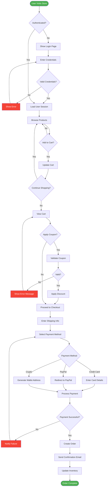
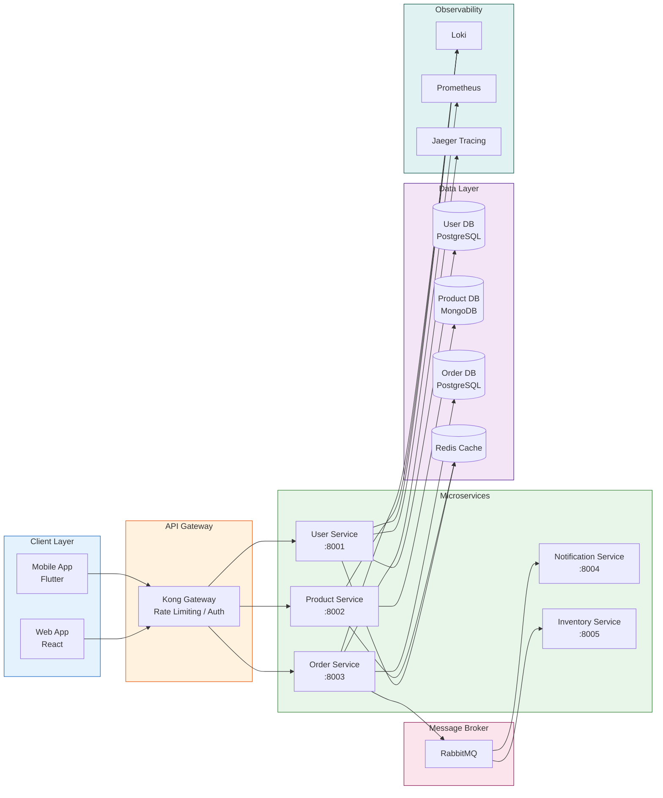
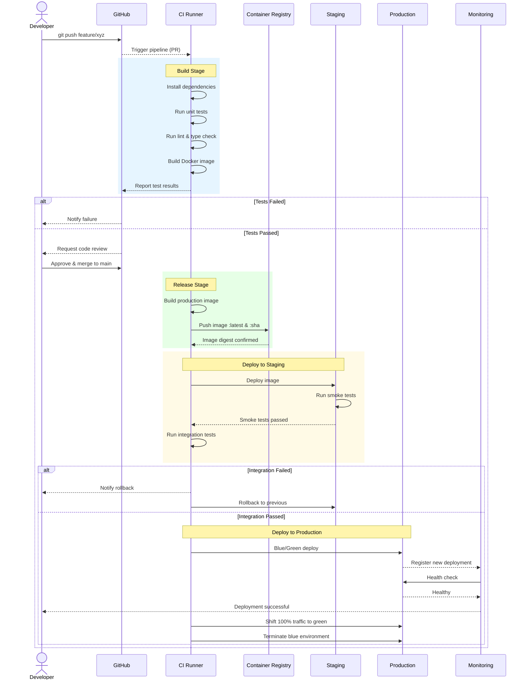
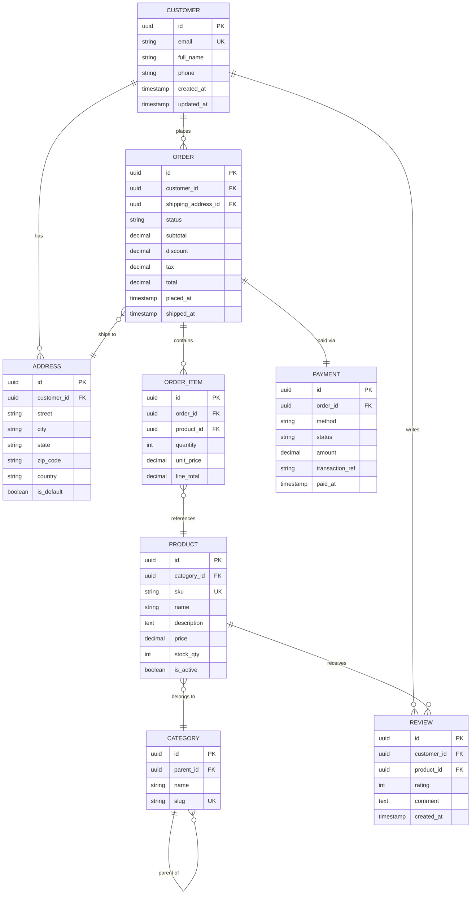
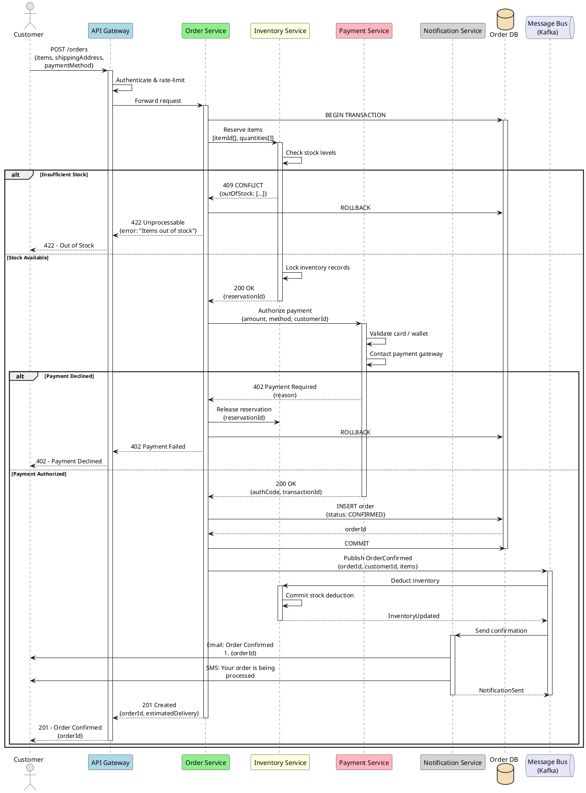
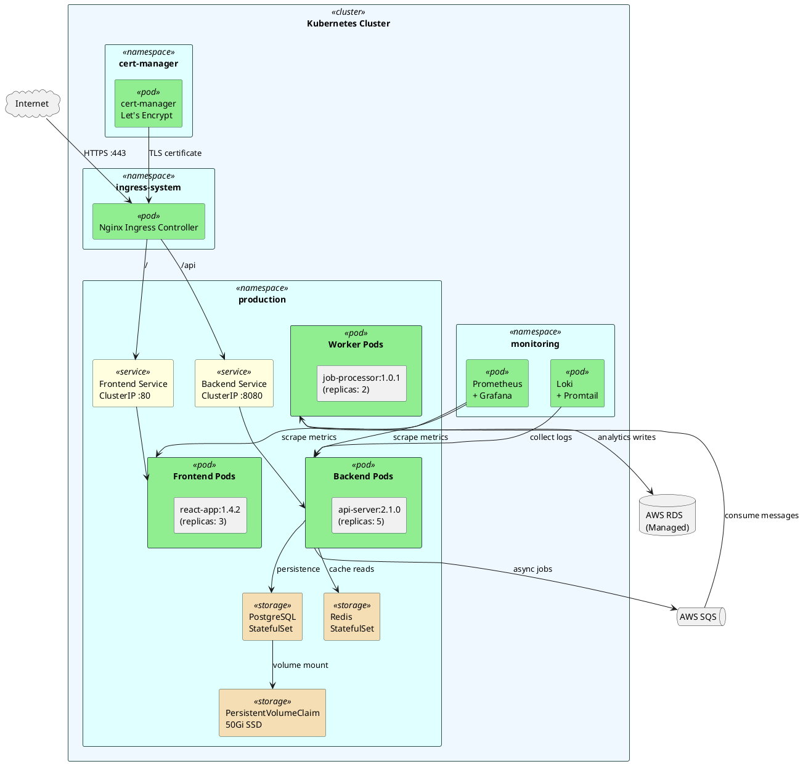

---

## 8. LaTeX/MathJax: Formula Examples

This section demonstrates inline and display math using LaTeX syntax. These formulas should render as typeset math in both preview and export (HTML/PDF) if MathJax is working correctly.

### Inline math

Euler's identity: $e^{i\pi} + 1 = 0$

Pythagorean theorem: $a^2 + b^2 = c^2$

### Display math

$$
\int_{-\infty}^{\infty} e^{-x^2} \, dx = \sqrt{\pi}
$$

$$
\nabla \cdot \vec{E} = \frac{\rho}{\varepsilon_0}
$$

$$
\sum_{n=1}^{\infty} \frac{1}{n^2} = \frac{\pi^2}{6}
$$

$$
\left(\begin{array}{cc}
    a & b \\
    c & d
\end{array}\right)
$$
# Sample Document: Complex Diagrams

This document demonstrates complex **Mermaid** and **PlantUML** diagrams for testing the xmarkdown2pdf extension.

---

## 1. Mermaid: E-Commerce System Flowchart

---

## 2. Mermaid: Microservices Architecture

---

## 3. Mermaid: CI/CD Pipeline Sequence

---

## 4. Mermaid: Entity-Relationship Diagram

---

## 5. PlantUML: Banking System Class Diagram

```plantuml
@startuml Banking System Class Diagram

skinparam classAttributeIconSize 0
skinparam class {
    BackgroundColor<<Entity>> LightBlue
    BackgroundColor<<Service>> LightGreen
    BackgroundColor<<Repository>> LightYellow
    BackgroundColor<<ValueObject>> LightPink
    BorderColor DarkSlateGray
    ArrowColor DarkSlateGray
}

package "Domain" {

    abstract class Account <<Entity>> {
        - id: UUID
        - accountNumber: String
        - balance: Money
        - status: AccountStatus
        - createdAt: LocalDateTime
        + getBalance(): Money
        + isActive(): boolean
        + {abstract} getAccountType(): AccountType
    }

    class CheckingAccount <<Entity>> {
        - overdraftLimit: Money
        - monthlyFee: Money
        + canOverdraw(amount: Money): boolean
        + getAccountType(): AccountType
    }

    class SavingsAccount <<Entity>> {
        - interestRate: BigDecimal
        - withdrawalLimit: int
        - currentMonthWithdrawals: int
        + accrueInterest(): void
        + getAccountType(): AccountType
    }

    class LoanAccount <<Entity>> {
        - principal: Money
        - interestRate: BigDecimal
        - termMonths: int
        - nextPaymentDate: LocalDate
        + calculateMonthlyPayment(): Money
        + getAccountType(): AccountType
    }

    class Customer <<Entity>> {
        - id: UUID
        - firstName: String
        - lastName: String
        - email: String
        - phone: String
        - kycStatus: KycStatus
        + getFullName(): String
        + isKycVerified(): boolean
    }

    class Transaction <<Entity>> {
        - id: UUID
        - type: TransactionType
        - amount: Money
        - timestamp: LocalDateTime
        - reference: String
        - description: String
        + isCredit(): boolean
        + isDebit(): boolean
    }

    class Money <<ValueObject>> {
        - amount: BigDecimal
        - currency: Currency
        + add(other: Money): Money
        + subtract(other: Money): Money
        + isGreaterThan(other: Money): boolean
        + isNegative(): boolean
    }

    enum AccountStatus <<ValueObject>> {
        ACTIVE
        FROZEN
        CLOSED
        PENDING_APPROVAL
    }

    enum TransactionType <<ValueObject>> {
        DEPOSIT
        WITHDRAWAL
        TRANSFER_IN
        TRANSFER_OUT
        INTEREST
        FEE
        LOAN_PAYMENT
    }
}

package "Application Services" {

    class AccountService <<Service>> {
        - accountRepo: AccountRepository
        - transactionRepo: TransactionRepository
        - eventPublisher: DomainEventPublisher
        + openAccount(cmd: OpenAccountCommand): Account
        + deposit(accountId: UUID, amount: Money): Transaction
        + withdraw(accountId: UUID, amount: Money): Transaction
        + transfer(fromId: UUID, toId: UUID, amount: Money): void
        + closeAccount(accountId: UUID): void
    }

    class CustomerService <<Service>> {
        - customerRepo: CustomerRepository
        - kycProvider: KycProvider
        + registerCustomer(cmd: RegisterCustomerCommand): Customer
        + verifyKyc(customerId: UUID): KycStatus
        + updateContactInfo(cmd: UpdateContactCommand): void
    }

    class LoanService <<Service>> {
        - loanRepo: AccountRepository
        - creditScoreProvider: CreditScoreProvider
        + applyForLoan(cmd: LoanApplicationCommand): LoanAccount
        + processPayment(loanId: UUID, payment: Money): Transaction
        + calculateAmortizationSchedule(loanId: UUID): List
    }
}

package "Infrastructure" {

    interface AccountRepository <<Repository>> {
        + findById(id: UUID): Optional<Account>
        + findByAccountNumber(num: String): Optional<Account>
        + findAllByCustomerId(customerId: UUID): List<Account>
        + save(account: Account): Account
        + delete(id: UUID): void
    }

    interface CustomerRepository <<Repository>> {
        + findById(id: UUID): Optional<Customer>
        + findByEmail(email: String): Optional<Customer>
        + save(customer: Customer): Customer
    }

    interface TransactionRepository <<Repository>> {
        + findById(id: UUID): Optional<Transaction>
        + findByAccountId(accountId: UUID): List<Transaction>
        + findByDateRange(from: LocalDate, to: LocalDate): List<Transaction>
        + save(tx: Transaction): Transaction
    }
}

Account <|-- CheckingAccount
Account <|-- SavingsAccount
Account <|-- LoanAccount
Account "1" *-- "many" Transaction : records
Account --> Money : balance
Account --> AccountStatus : status
Transaction --> Money : amount
Transaction --> TransactionType : type
Customer "1" *-- "many" Account : owns

AccountService ..> AccountRepository : uses
AccountService ..> TransactionRepository : uses
CustomerService ..> CustomerRepository : uses
LoanService ..> AccountRepository : uses

@enduml
```

---

## 6. PlantUML: Distributed Order Processing Sequence

---

## 7. PlantUML: Kubernetes Deployment Infrastructure

---

## Summary

| Diagram | Type | Complexity |
|---|---|---|
| E-Commerce Flowchart | Mermaid Flowchart | Complex branching with styles |
| Microservices Architecture | Mermaid Graph | Subgraphs & layered services |
| CI/CD Pipeline | Mermaid Sequence | Actors, loops, alt blocks |
| ER Diagram | Mermaid ERD | Full e-commerce schema |
| Banking Class Diagram | PlantUML Class | Inheritance, packages, enums |
| Order Processing | PlantUML Sequence | Distributed system, alt/loop |
| K8s Infrastructure | PlantUML Deployment | Cloud infrastructure layout |
